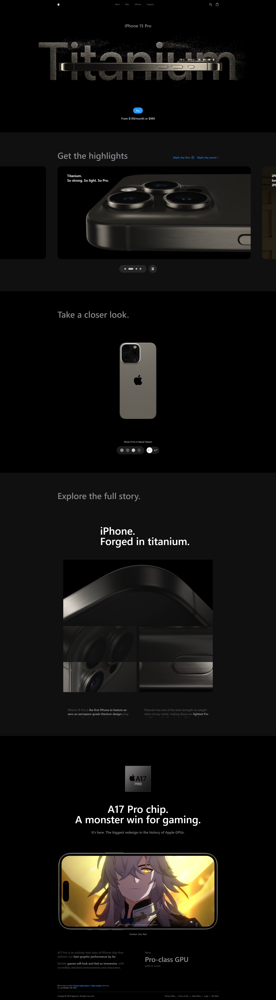

# Apple Clone Website Landing Page

*Apple Clone Landing Page*

## Introduction
This project is a clone of the Apple website landing page. It aims to replicate the sleek and modern design of Apple's official site using React for efficient component-based development, Three.js for 3D graphics, React Three Fiber and React Three Drei for easier integration with React, and GSAP for advanced animations and smooth transitions.

## Features
- Responsive design for all devices
- Interactive elements mimicking Apple's website
- Smooth animations and transitions
- Clean and modern UI/UX

## Technologies Used
- **React.js:** For building the user interface.
- **Three.js:** For 3D graphics.
- **React Three Fiber:** For integrating Three.js with React.
- **React Three Drei:** For additional utilities and helpers for React Three Fiber.
- **GSAP (Greensock):** For animations and transitions.
- **Vite:** For fast and efficient development.
- **Tailwind CSS:** For styling the website.
- **Flexbox & Grid:** For layout and alignment.

## Credits
This project is a clone and is not affiliated with or endorsed by Apple Inc. All rights to the original design and content belong to Apple Inc.
